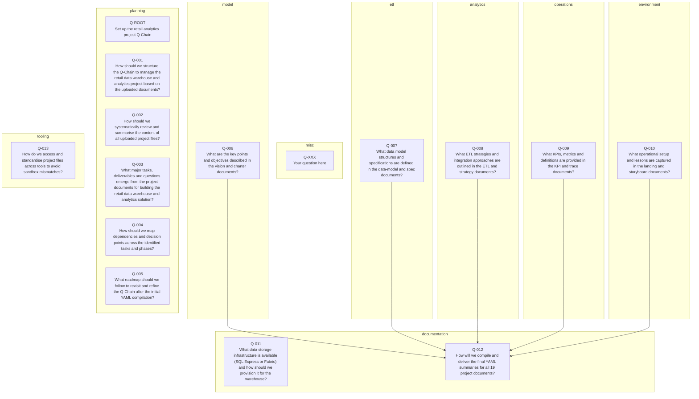

```mermaid
flowchart TB
  Q-ROOT["Q-ROOT<br/>Set up the retail analytics project Q‑Chain"]
  Q-001["Q-001<br/>How should we structure the Q‑Chain to manage the retail data warehouse and analytics project based on the uploaded documents?"]
  Q-002["Q-002<br/>How should we systematically review and summarise the content of all uploaded project files?"]
  Q-003["Q-003<br/>What major tasks, deliverables and questions emerge from the project documents for building the retail data warehouse and analytics solution?"]
  Q-004["Q-004<br/>How should we map dependencies and decision points across the identified tasks and phases?"]
  Q-005["Q-005<br/>What roadmap should we follow to revisit and refine the Q‑Chain after the initial YAML compilation?"]
  Q-006["Q-006<br/>What are the key points and objectives described in the vision and charter documents?"]
  Q-007["Q-007<br/>What data model structures and specifications are defined in the data‑model and spec documents?"]
  Q-008["Q-008<br/>What ETL strategies and integration approaches are outlined in the ETL and strategy documents?"]
  Q-009["Q-009<br/>What KPIs, metrics and definitions are provided in the KPI and trace documents?"]
  Q-010["Q-010<br/>What operational setup and lessons are captured in the landing and storyboard documents?"]
  Q-011["Q-011<br/>What data storage infrastructure is available (SQL Express or Fabric) and how should we provision it for the warehouse?"]
  Q-012["Q-012<br/>How will we compile and deliver the final YAML summaries for all 19 project documents?"]
  Q-013["Q-013<br/>How do we access and standardise project files across tools to avoid sandbox mismatches?"]
  Q-XXX["Q-XXX<br/>Your question here"]
  subgraph "analytics"
    Q-008
  end
  subgraph "documentation"
    Q-011
    Q-012
  end
  subgraph "environment"
    Q-010
  end
  subgraph "etl"
    Q-007
  end
  subgraph "misc"
    Q-XXX
  end
  subgraph "model"
    Q-006
  end
  subgraph "operations"
    Q-009
  end
  subgraph "planning"
    Q-001
    Q-002
    Q-003
    Q-004
    Q-005
    Q-ROOT
  end
  subgraph "tooling"
    Q-013
  end
  Q-006 --> Q-012
  Q-007 --> Q-012
  Q-008 --> Q-012
  Q-009 --> Q-012
  Q-010 --> Q-012
```