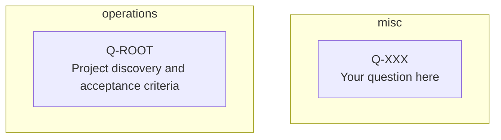

```mermaid
flowchart TB
  Q-ROOT["Q-ROOT<br/>Project discovery and acceptance criteria"]
  Q-XXX["Q-XXX<br/>Your question here"]
  subgraph "misc"
    Q-XXX
  end
  subgraph "operations"
    Q-ROOT
  end
```