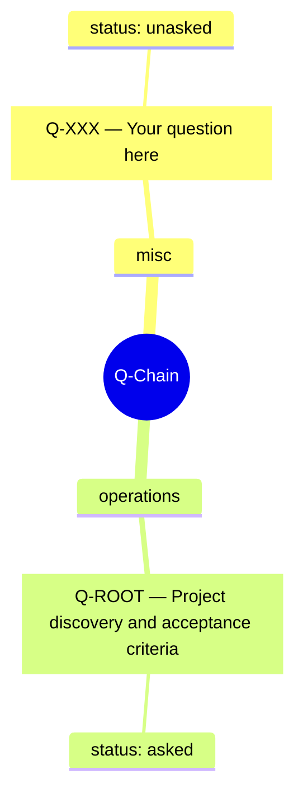

```mermaid
mindmap
  root((Q-Chain))
    misc
      Q-XXX[Q-XXX — Your question here]
        status: unasked
    operations
      Q-ROOT[Q-ROOT — Project discovery and acceptance criteria]
        status: asked
```